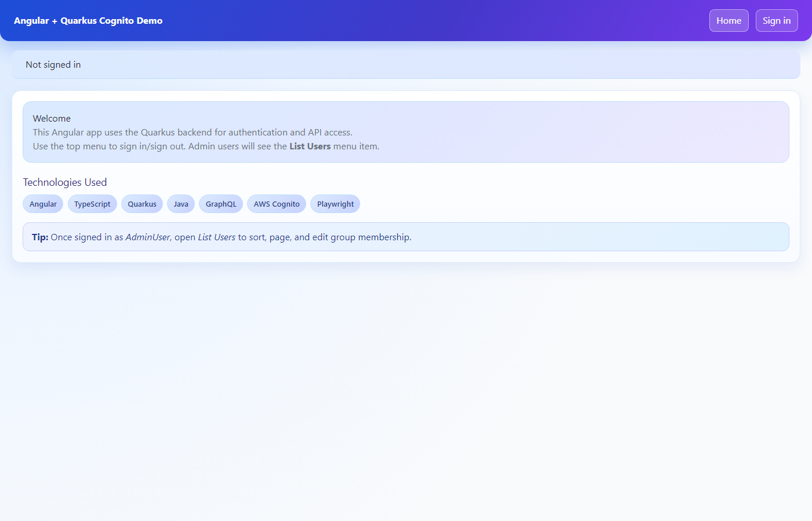
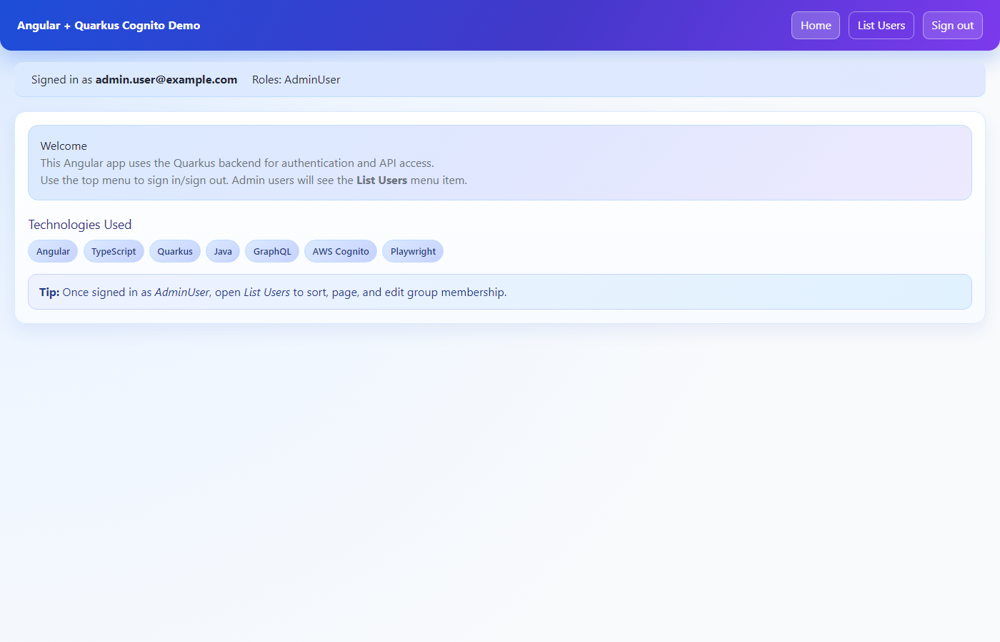
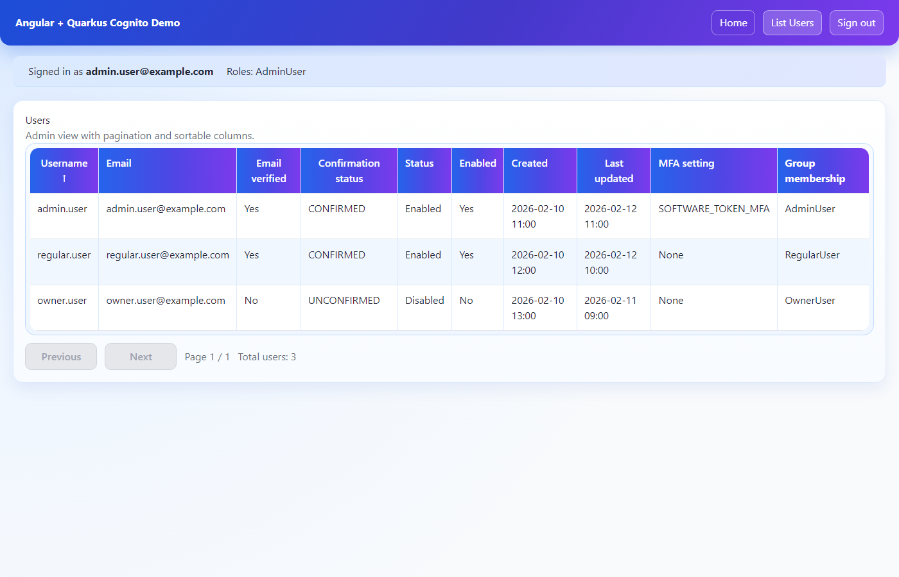

# Angular + Quarkus + AWS Cognito Demo

**Technologies:**


**Frontend:**
[](https://github.com/tomassvensson/angular-quarkus-demo/actions/workflows/frontend-build.yml)
[](https://github.com/tomassvensson/angular-quarkus-demo/actions/workflows/frontend-tests.yml)
[](https://sonarcloud.io/summary/new_code?id=tomassvensson_angular-quarkus-demo-frontend)
[](https://sonarcloud.io/summary/new_code?id=tomassvensson_angular-quarkus-demo-frontend)

**Backend:**
[](https://github.com/tomassvensson/angular-quarkus-demo/actions/workflows/backend-build.yml)
[](https://github.com/tomassvensson/angular-quarkus-demo/actions/workflows/backend-tests.yml)
[](https://sonarcloud.io/summary/new_code?id=tomassvensson_angular-quarkus-demo-backend)
[](https://sonarcloud.io/summary/new_code?id=tomassvensson_angular-quarkus-demo-backend)

**Integration & Security:**
[](https://github.com/tomassvensson/angular-quarkus-demo/actions/workflows/e2e-tests.yml)
[](https://github.com/tomassvensson/angular-quarkus-demo/actions/workflows/security.yml)
[](https://codecov.io/gh/tomassvensson/angular-quarkus-demo)

Full-stack demo application with:

- **Angular 21** frontend with SSR (`frontend/`)
- **Quarkus 3 / Java 21** backend (`backend/`)
- **AWS Cognito** (or Keycloak) login/logout and role-based access
- **GraphQL API** at `/api/v1/graphql`
- **DynamoDB** for link-list persistence
- **CloudWatch Logs** for centralized log collection

## Architecture

### System Overview

```text
┌─────────────────────────────────────────────────────────────────────┐
│                          Browser                                    │
│  Angular 21 + Tailwind CSS  (http://localhost:4200)                 │
│  ┌───────────┬──────────────┬──────────────┬──────────────────────┐ │
│  │ Home Page │ My Lists     │ Public Lists │ Admin Users (admin)  │ │
│  │           │ (CRUD links) │ (paginated)  │ (role management)    │ │
│  └───────────┴──────────────┴──────────────┴──────────────────────┘ │
│  Services: GraphqlApiService, LinkService, LogCollectorService      │
│  Interceptors: ErrorInterceptor (401 → redirect)                    │
└──────────────────────────┬──────────────────────────────────────────┘
                           │ HTTP (session cookie, withCredentials)
                           ▼
┌─────────────────────────────────────────────────────────────────────┐
│                    Quarkus Backend (:8080)                           │
│  ┌──────────────┐  ┌──────────────────┐  ┌───────────────────────┐ │
│  │ OIDC Auth    │  │ GraphQL API      │  │ REST Endpoints        │ │
│  │ /login       │  │ /api/v1/graphql  │  │ /hello, /user, /home  │ │
│  │ /logout      │  │ UserGraphQLApi   │  │ /api/v1/logs          │ │
│  │              │  │ LinkGraphQLRes.  │  │                       │ │
│  └──────┬───────┘  └───────┬──────────┘  └───────────────────────┘ │
│         │                  │                                        │
│  ┌──────▼───────┐  ┌──────▼──────────┐  ┌───────────────────────┐ │
│  │ Login Policy │  │ Link Service    │  │ CloudWatch Log Svc    │ │
│  │ (disallow    │  │ (DynamoDB CRUD) │  │ (log ingestion)       │ │
│  │  usernames)  │  │                 │  │                       │ │
│  └──────────────┘  └───────┬─────────┘  └───────────┬───────────┘ │
└─────────────────────────────┼────────────────────────┼──────────────┘
                              │                        │
          ┌───────────────────┼────────────────────────┼──────┐
          │                 AWS Cloud                          │
          │  ┌──────────────┐ ┌──────────┐ ┌───────────────┐  │
          │  │ Cognito User │ │ DynamoDB │ │ CloudWatch    │  │
          │  │ Pool + Admin │ │          │ │ Logs          │  │
          │  │ API          │ │          │ │               │  │
          │  └──────────────┘ └──────────┘ └───────────────┘  │
          └────────────────────────────────────────────────────┘
```

### Component Summary

| Layer | Component | Purpose |
| ----- | --------- | ------- |
| **Frontend** | `HomePageComponent` | Landing page with role-aware content |
| | `MyListsComponent` | CRUD for user's own link lists |
| | `ListDetailComponent` | View/manage individual list and its links |
| | `PublicListsComponent` | Browse published lists (paginated) |
| | `ProfilePageComponent` | View current user profile |
| | `AdminUsersPageComponent` | Admin: list/search/edit users (paginated) |
| | `UserEditPageComponent` | Admin: edit user roles and attributes |
| | `GraphqlApiService` | Auth/user admin GraphQL client |
| | `LinkService` | Link-list GraphQL client |
| | `LogCollectorService` | Batch-sends browser console logs to backend |
| | `ErrorInterceptor` | HTTP error handler, redirects on 401 |
| **Backend** | `UserGraphQLApi` | GraphQL: user queries, admin mutations |
| | `LinkGraphQLResource` | GraphQL: link-list CRUD, publish/unpublish |
| | `LogIngestionResource` | REST: receives frontend logs → CloudWatch |
| | `LoginPolicyService` | Blocks disallowed usernames at login |
| | `LinkService` | DynamoDB CRUD for lists/links |
| | `CloudWatchLogService` | Writes log entries to CloudWatch Logs |
| | `CognitoAdminService` | Cognito user pool admin operations |
| | `DynamoDBConfig` | DynamoDB client configuration |

### Key Behavior

- Backend owns authentication flow and secrets (OIDC session cookies).
- Frontend uses session-based calls (`withCredentials`) to GraphQL.
- **Auth provider switching**: Cognito in production, Keycloak in dev/test (via Quarkus profiles).
- Role-based menu visibility and admin user management UI.
- Login policy blocks disallowed usernames via `app.test.disallowed-usernames`.
- **Link lists**: Users can create, edit, and delete personal link lists. Lists can be published for public browsing.
- **Public lists**: Browsable with server-side pagination (configurable page size).
- **CloudWatch logging**: Frontend console logs are batch-collected and sent to backend, which forwards them to CloudWatch Logs.
- **Health checks**: Available at `/q/health`, `/q/health/live`, `/q/health/ready` (unauthenticated).
- **Error handling**: Frontend `ErrorInterceptor` catches HTTP errors; 401s trigger re-authentication redirect.

## Technologies Used

- **Frontend**: Angular 21, TypeScript, Tailwind CSS, SSR (Angular Universal)
- **Backend**: Quarkus 3.31, Java 21, SmallRye GraphQL, OIDC (web-app flow)
- **AWS Services**: Cognito User Pool + Admin API, DynamoDB, CloudWatch Logs
- **Auth (dev/test)**: Keycloak (via Quarkus Dev Services / Docker Compose)
- **Local AWS**: LocalStack (DynamoDB + CloudWatch + Cognito for CI)
- **Testing**: Vitest (unit), Playwright (E2E), JUnit 5 + Testcontainers (backend)
- **Code Quality**: SonarCloud (frontend + backend), Trivy FS scan, JaCoCo coverage
- **Build/CI**: Maven Wrapper, npm, GitHub Actions (6 workflows)

## Product Screenshots

### Login screen



### Role-based menu



### Admin user management view



## Implementation Status

### ✅ Implemented

- Login/logout redirects handled by backend and returned to Angular
- Versioned GraphQL endpoint at `/api/v1/graphql`
- Role-based menu visibility and admin user listing/editing UI
- Admin user management: list (paginated), search, edit roles and attributes
- Disallowed username login policy via `app.test.disallowed-usernames`
- Long session idle extension configuration (`12H`) and auth-loss redirect behavior
- **Link Lists**: Create, edit, delete personal link lists with link management
- **Public Lists**: Browse published lists with server-side pagination
- **CloudWatch Logging**: Frontend console log collection → backend → CloudWatch Logs
- **Health Checks**: `/q/health`, `/q/health/live`, `/q/health/ready` (public)
- **Error Interceptor**: Global HTTP error handling with 401 redirect
- **Auth Switching**: Cognito (production) ↔ Keycloak (dev/test) via Quarkus profiles
- **DynamoDB**: Link-list persistence with automatic table creation in dev/test
- Frontend build/tests/E2E and backend tests in GitHub Actions (6 workflows)
- SonarCloud analysis for both frontend and backend with coverage reporting
- Security scanning with Trivy filesystem scan

### ⏳ Work in Progress / Next Improvements

- Full hosted-Cognito UI auth E2E in CI (currently excluded as `external-auth`)
- Deeper admin CRUD flows (create/delete users, richer validation)
- Refresh token/session edge-case hardening for multi-tab race conditions
- Production deployment automation (IaC + environment promotion)

## External Dependencies

Install locally:
- **Java 21**
- **Node.js 20+** and **npm**
- **AWS account** with Cognito User Pool configured
- **AWS credentials** that allow Cognito Admin API access (for admin GraphQL operations)

For GitHub Actions CI, AWS cloud access is not required for basic pipeline validation because LocalStack is used.

## Repository Structure

```text
├── backend/                    Quarkus API + OIDC + GraphQL
│   ├── src/main/java/org/acme/
│   │   ├── config/             DynamoDB client configuration
│   │   ├── graphql/            GraphQL API + model DTOs
│   │   ├── model/              Domain entities (Link, LinkList)
│   │   ├── resource/           GraphQL + REST resources
│   │   ├── security/           Login policy enforcement
│   │   └── service/            Business logic (LinkService, CloudWatch, Cognito)
│   └── src/test/               JUnit 5 + Testcontainers tests
├── frontend/                   Angular UI + Playwright E2E
│   ├── src/app/
│   │   ├── pages/              7 page components (home, lists, admin, profile)
│   │   ├── services/           GraphQL clients + log collector
│   │   └── interceptors/       HTTP error interceptor
│   ├── e2e/                    Playwright E2E tests + fixtures
│   └── public/                 Static assets
└── .github/
    ├── workflows/              6 CI workflows (build, test, E2E, security)
    ├── keycloak/               Keycloak Docker Compose + realm export
    └── localstack/             LocalStack Docker Compose + seed script
```

## Configuration

### Important security note
Do **not** commit real secrets. Use environment variables or profile-local files for:
- Cognito client secret
- any cloud credentials

### Required backend settings
These are the key values used by the app:

- `quarkus.oidc.auth-server-url`
- `quarkus.oidc.client-id`
- `quarkus.oidc.credentials.secret`
- `cognito.domain`
- `cognito.user-pool-id`
- `app.frontend-base-url` (default: `http://localhost:4200`)
- `app.test.disallowed-usernames` (comma-separated local parts before `@`)

### Environment variable equivalents
Quarkus properties can be overridden via environment variables. Common ones:

- `QUARKUS_OIDC_AUTH_SERVER_URL`
- `QUARKUS_OIDC_CLIENT_ID`
- `QUARKUS_OIDC_CREDENTIALS_SECRET`
- `COGNITO_DOMAIN`
- `COGNITO_USER_POOL_ID`
- `APP_FRONTEND_BASE_URL`
- `APP_TEST_DISALLOWED_USERNAMES`
- `AWS_REGION`
- `AWS_ACCESS_KEY_ID`
- `AWS_SECRET_ACCESS_KEY`
- `AWS_SESSION_TOKEN` (if using temporary credentials)

## AWS Cognito Setup

Create/use a Cognito User Pool and App Client with:

1. **OAuth flow**: Authorization code grant
2. **Scopes**: at least `openid`, `email`
3. **Identity provider**: Cognito user pool directory
4. **Allowed callback URLs** (local):
	- `http://localhost:8080/login`
	- `http://localhost:8080/login/oauth2/code/cognito` (optional compatibility)
	- `http://localhost:8081/login` (for tests)
	- `http://localhost:8081/login/oauth2/code/cognito` (optional compatibility)
5. **Allowed sign-out URLs**:
	- `http://localhost:4200/`
	- `http://localhost:8080/`
	- `http://localhost:8081/`
6. Create groups used by the app:
	- `RegularUser`
	- `AdminUser`
	- `OwnerUser`
	- `NoPermissionsTestUser`

## Run Locally

### 1) Start backend

From repo root:

```bash
cd backend
./mvnw quarkus:dev
```

Backend URL: `http://localhost:8080`

### 2) Start frontend

In another terminal:

```bash
cd frontend
npm install
npm start
```

Frontend URL: `http://localhost:4200`

### 3) Open in browser

Start here:
- `http://localhost:4200`

Login/logout endpoints (backend-handled):
- `http://localhost:8080/login`
- `http://localhost:8080/logout`

GraphQL endpoint:
- `http://localhost:8080/api/v1/graphql`

## LocalStack (Optional Local CI-like Testing)

Start LocalStack services used by CI:

```bash
docker compose -f .github/localstack/docker-compose.localstack.yml up -d
```

Seed Cognito + SSM test resources:

```bash
bash .github/localstack/seed-localstack.sh
```

This creates:
- Cognito user pool + app client
- groups: `RegularUser`, `AdminUser`, `OwnerUser`, `NoPermissionsTestUser`
- seeded users assigned to groups
- SSM parameters for pool/client config

## Testing

### Backend tests

```bash
cd backend
./mvnw test
```

For CI-style run (exclude hosted-Cognito UI browser test):

```bash
cd backend
./mvnw test -Djunit.jupiter.tags.exclude=external-auth
```

Includes:
- API and integration tests
- GraphQL smoke test
- login policy tests
- Playwright-based backend E2E checks

### Frontend unit tests

```bash
cd frontend
npm test -- --watch=false
```

### Frontend E2E tests (Playwright)

```bash
cd frontend
npm run e2e
```

If Playwright browsers are missing:

```bash
npx playwright install chromium
```

## GitHub Actions: test before pushing

You can run almost the same pipeline locally to avoid wasting GitHub minutes:

1. Run the same commands locally:
	- backend build: `cd backend && ./mvnw -DskipTests package`
	- backend tests: `cd backend && ./mvnw test`
	- frontend build: `cd frontend && npm ci && npm run build`
	- frontend tests: `cd frontend && npm test -- --watch=false`
	- frontend e2e: `cd frontend && npm run e2e`

2. Run LocalStack-backed backend test prep locally:
	- `docker compose -f .github/localstack/docker-compose.localstack.yml up -d`
	- `bash .github/localstack/seed-localstack.sh`

3. Optional: run GitHub workflows locally with `act`:
	- install `act` (https://github.com/nektos/act)
	- run specific workflow, for example:
	  - `act push -W .github/workflows/backend-tests.yml`
	  - `act push -W .github/workflows/frontend-tests.yml`

Note: `act` and GitHub-hosted runners are similar but not identical; always treat local runs as pre-checks and GitHub as final truth.

## Troubleshooting

- **Login redirect mismatch**: confirm callback/sign-out URLs in Cognito exactly match local ports.
- **Admin user list fails**: verify AWS credentials and Cognito permissions.
- **Frontend cannot call API**: ensure backend is running on `:8080` and CORS allows `http://localhost:4200`.
- **Session issues**: app is configured for long idle extension (`12H`); verify OIDC and browser cookie settings.

## GitHub CI

Workflow files:
- `.github/workflows/backend-build.yml` — Build backend (Maven package)
- `.github/workflows/backend-tests.yml` — Backend unit + integration tests
- `.github/workflows/frontend-build.yml` — Build frontend (Angular SSR)
- `.github/workflows/frontend-tests.yml` — Frontend unit tests (Vitest)
- `.github/workflows/e2e-tests.yml` — Full E2E tests (Keycloak + backend + Playwright)
- `.github/workflows/security.yml` — SonarCloud analysis + Trivy vulnerability scan

They run on every push and pull request and provide separate pass/fail badges.

## Security Posture Notes

- **CSRF strategy**: keep state-changing operations behind authenticated GraphQL calls with cookie session; for production, add explicit CSRF token validation (double-submit or synchronizer token) on mutation routes.
- **Cookie flags (production expectation)**: `Secure`, `HttpOnly`, `SameSite=Lax` (or `Strict` if UX permits), and TLS-only ingress.
- **Secrets management**:
	- local/dev: environment variables and LocalStack SSM for test-only values
	- production: managed secret store (AWS SSM Parameter Store / Secrets Manager), never checked into repo
- **Static analysis**: SonarCloud runs on every push for both frontend and backend, checking code quality, security hotspots, and code coverage.
- **Vulnerability scanning**: Trivy filesystem scan runs in CI to detect known CVEs in dependencies.

## Notes for Production

- Move secrets out of `application.properties`.
- Use environment-specific config/profiles.
- Restrict `app.test.disallowed-usernames` as part of deployment policy.
